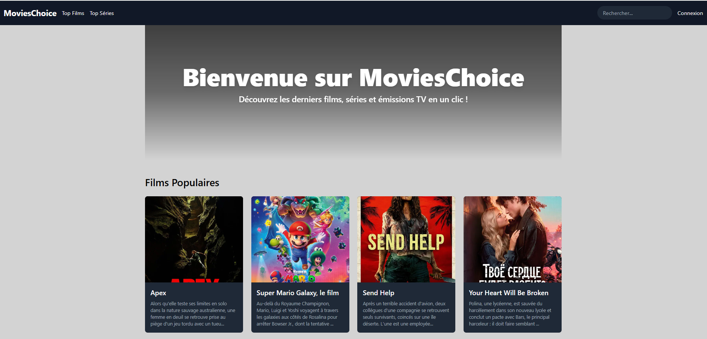
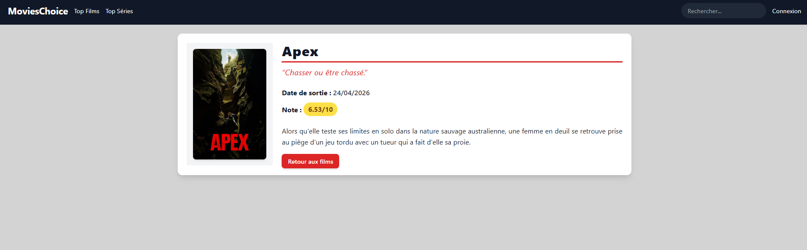
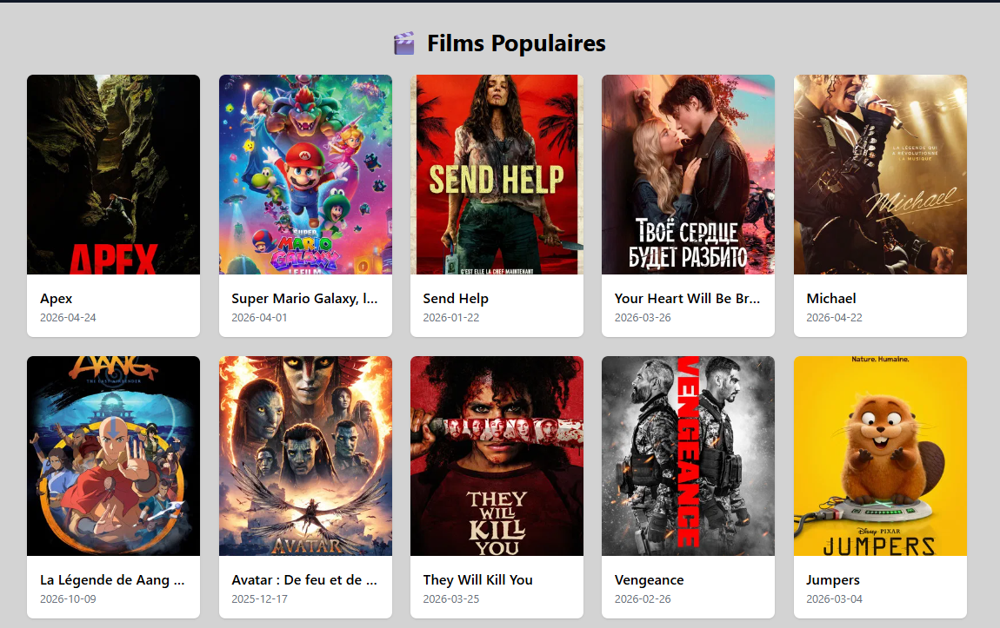
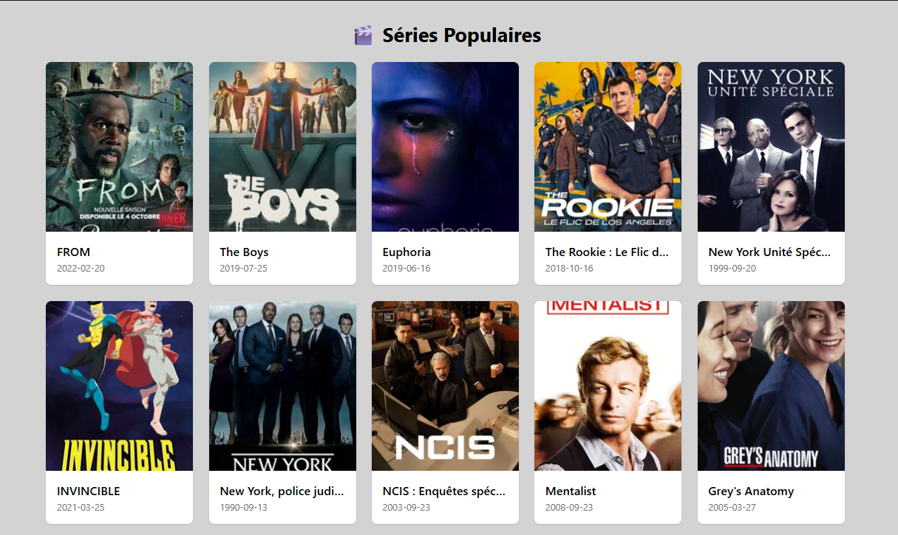

# MoviesChoice



**📌 À propos du projet MoviesChoice**

**🗓️ Date de création**
📅 **Mars 2024**

**🏫 Réalisé dans le cadre de**
🎓 **Projet perso**

**🔗 Lien GitHub**
📂 [Voir le code sur GitHub](https://github.com/GuillaumeReb/MoviesChoice)

**🚀 Démo en ligne**

<!--🌐 [Voir la démo en ligne](https://guillaume-rebourgeon.fr/movie/public/)-->

**🛠️ Technologies utilisées**

- **Backend :** PHP 8, Symfony 7.1.8
- **Frontend :** HTML, Tailwind CSS, JavaScript
- **Build Tool :** Webpack Encore
- **API :** TMDB (The Movie Database)
- **Outils qualité :** PHP_CodeSniffer, PHPStan
- **Serveur :** Apache, MySQL

**📖 Description du projet**

MoviesChoice est une **application web de découverte de films et séries** qui utilise l'API TMDB pour afficher des informations détaillées sur les contenus cinématographiques.

L'utilisateur peut :

- 🎬 **Parcourir les films** populaires et tendances
- 📺 **Découvrir les séries** du moment
- 🔍 **Consulter les détails** de chaque film/série (synopsis, casting, notes...)
- 📱 **Naviguer facilement** grâce à une interface responsive

**🎯 Compétences développées**

- **Intégration d'API REST** : Consommation de l'API TMDB
- **Framework Symfony** : Routing, contrôleurs, templates Twig
- **Responsive Design** : Utilisation de Tailwind CSS
- **Webpack Encore** : Gestion des assets et compilation
- **Déploiement** : Configuration serveur, gestion des environnements
- **Qualité de code** : PHP_CodeSniffer, PHPStan pour maintenir un code propre

**📸 Aperçu**

### Carte



<details>
  <summary>📸 Cliquez ici pour voir plus de captures d'écran</summary>

### Vue Films



### Vue Séries



</details>

**🏗️ Architecture technique**

```
src/
├── Controller/     # Logique métier
├── Entity/         # Modèles de données
├── Service/        # Services (API calls, etc.)
└── ...

templates/          # Vues Twig
assets/            # CSS/JS sources
public/build/      # Assets compilés
```

**💡 Défis techniques relevés**

- **Configuration en sous-dossier** : Adaptation des chemins pour un déploiement en sous-répertoire
- **Gestion des environnements** : Configuration différente local/production
- **Optimisation des assets** : Compilation conditionnelle selon l'environnement
- **Intégration API** : Gestion des appels asynchrones et affichage des données

**💡 Retour personnel**

Ce projet m'a permis de **maîtriser Symfony** dans un contexte réel avec intégration d'API externe. La gestion du **déploiement en sous-dossier** m'a fait comprendre l'importance de la configuration d'environnement. L'utilisation de **Tailwind CSS** m'a apporté une nouvelle approche du CSS utilitaire, très efficace pour le responsive design.

---

## 🚀 Installation & Lancement

### Prérequis

- PHP 8+
- Composer
- Node.js & npm
- Symfony CLI

### Installation

```bash
git clone [votre-repo]
cd MoviesChoice
composer install
npm install
npm run dev
```

### Configuration

```bash
# Copier et configurer l'environnement
cp .env .env.local
# Ajouter votre clé API TMDB dans .env.local
```

### Lancement

```bash
# Assets
npm run watch

# Serveur Symfony
symfony server:start
```

**🌐 Accès :** `localhost:8000`
